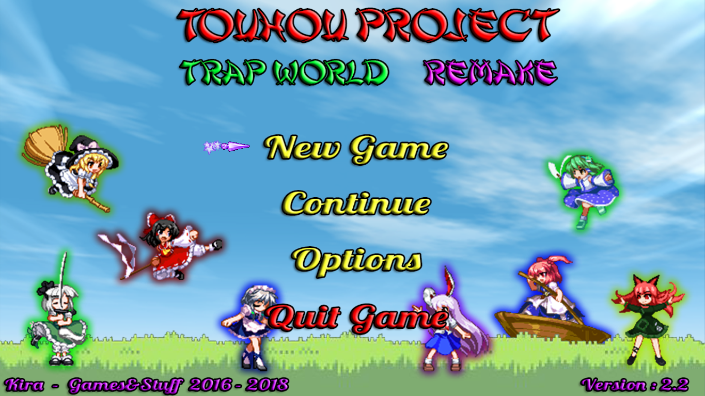
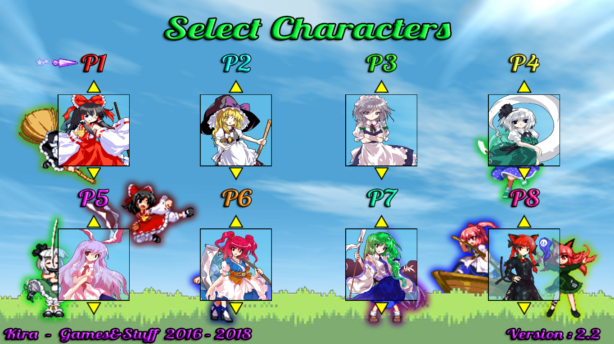
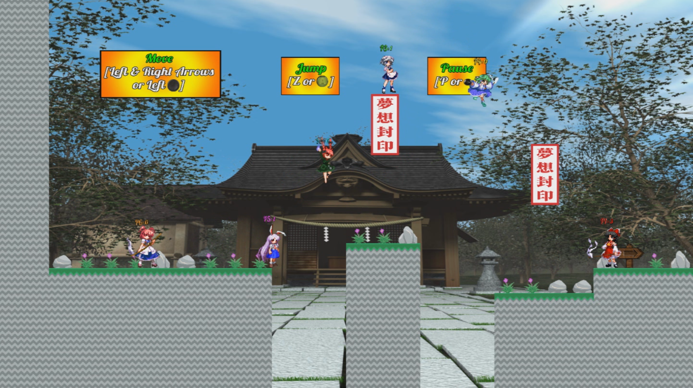
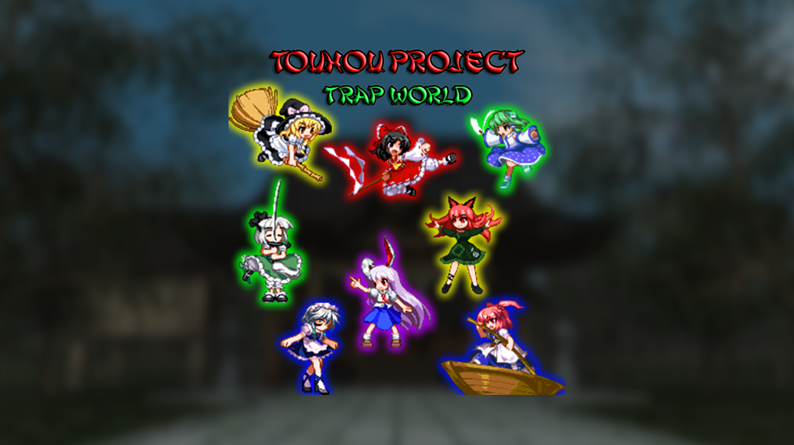

# Touhou Fangame - Trap World
Welcome everybody. This repository is to host a little Touhou fangame I made back in 2016. This game is completely free and I don't own anything from Touhou Project mark, all rights are reserved to ZUN and Team Shangai Alice.
- It's a local coop 2D platform game up to 8 players at the same time, highly inspired on rage games like Bloody Trapland. 
- The plot is simple, Yakumo Yukari is bored and she prepared some tests that you have to complete, nothing more. 
- The game has eight worlds with five stages each one and autosaves when you clear a stage.
- Default controls for keyboard are arrow keys to move and crouch, Z to jump and P to pause the game (you can change the jump and pause key).
- Other players need a controller to play, being the left joystick used to move and crouch, A to jump and Start to pause (on a Xbox controller). 
- Each player has a death counter above the character (it resets when you close the game).

Here's some screenshots played with 6 people at the same time:

  

  

  

You can also watch the full gameplay played with 6 people if you want [here](https://youtu.be/bsNZ0ANDrYo)

  

